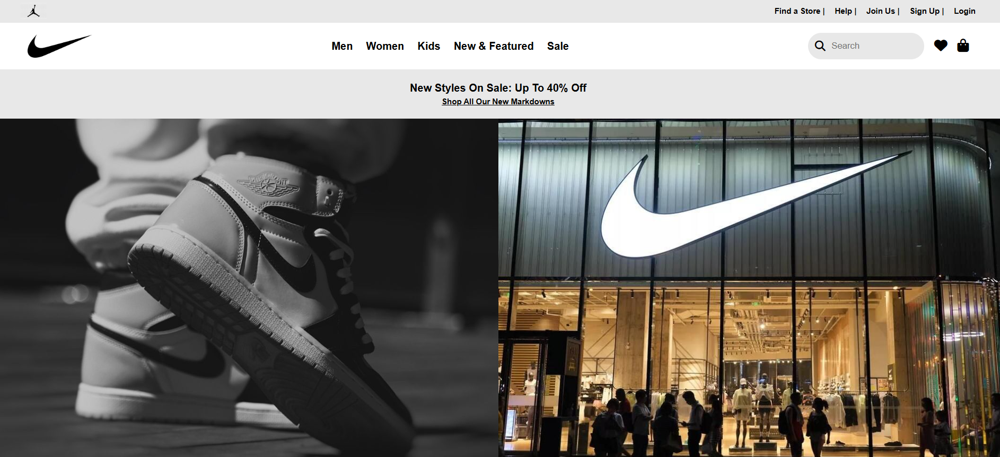
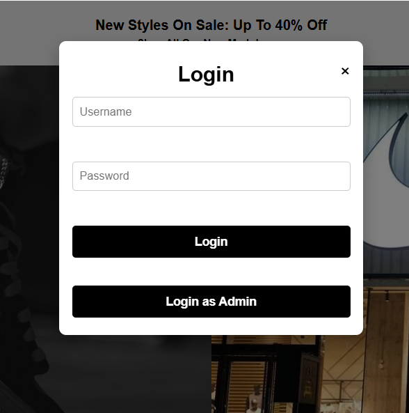
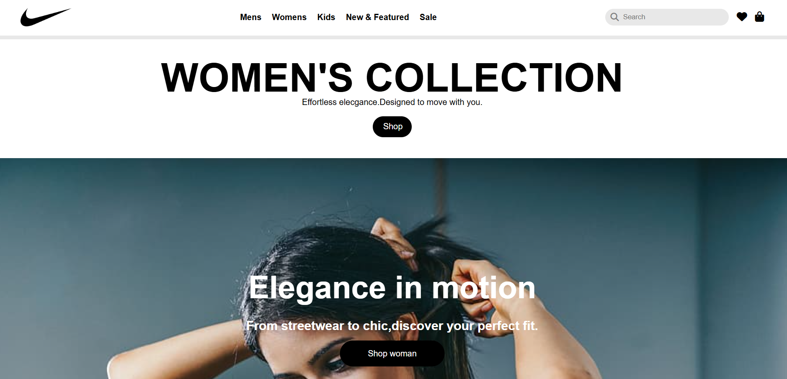

# Nike-Clone
A **Nike website clone** built using vanilla **HTML, CSS, and JavaScript** to demonstrate responsive UI design, navigation, and basic JavaScript functionality such as login using localStorage. This project is created for learning and practice purposes and is **not affiliated with Nike** or its official website. 

## 🚀 Features 
  Fully responsive design for different product sections 
✔ Navigation to Men, Women, Kids & Sale pages
✔ Basic **login/signup** functionality using browser localStorage
✔ Separate CSS & JS files for each page for modularity
✔ Practiced UI layout similar to Nike website (not an exact copy).

## 🛠️ Tech Stack This project is built using: -
**HTML5** – Structure of the website  
**CSS3** – Styling & layout  
**JavaScript** – DOM interaction & login logic No backend or database is used — login functionality uses browser **localStorage**. 

## 📂 Project Structure (important files) 
Nike-Clone/ ├── index.html ├── index.css ├── index.js ├── men.html ├── men.css ├── men.js ├── women.html ├── women.css ├── women.js ├── kids.html ├── kids.css ├── kids.js ├── sale.html ├── sale.css ├── sale.js ├── admin.html ├── admin.css ├── admin.js

## 🔐 Security Note
This project uses browser `localStorage` for login functionality for demo purposes only.  
In production applications, authentication should be handled securely on the backend.

## 📸 Screenshots

### Home Page

### Login Page

### Women Section

### Sign-up Section

